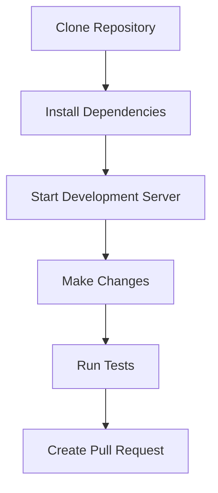

# 🍰 Bakery E-commerce Platform

<div align="center">

[](https://github.com/Hum2a/bakery/releases)
[](LICENSE.md)
[](https://github.com/Hum2a/bakery/actions)
[](https://github.com/Hum2a/bakery/actions)
[](https://david-dm.org/Hum2a/bakery)
[](https://github.com/Hum2a/bakery/graphs/contributors)
[](https://github.com/Hum2a/bakery/commits/main)
[](CONTRIBUTING.md)
[](https://prettier.io)
[](https://discord.gg/bakery)

</div>

<div align="center">
  
  
  <p>
    <strong>A modern e-commerce platform for bakeries</strong>
  </p>
  
  <p>
    <a href="#-features">Features</a> •
    <a href="#-getting-started">Getting Started</a> •
    <a href="#-documentation">Documentation</a> •
    <a href="#-contributing">Contributing</a>
  </p>
</div>

## 📋 Table of Contents

<details>
<summary>Click to expand</summary>

- [✨ Features](#-features)
- [🚀 Getting Started](#-getting-started)
- [🛠️ Tech Stack](#%EF%B8%8F-tech-stack)
- [📦 Installation](#-installation)
- [🔧 Configuration](#-configuration)
- [📁 Project Structure](#-project-structure)
- [🗄️ Backend Structure & Usage](#-backend-structure-&-usage)
- [🧪 Testing](#-testing)
- [📚 Documentation](#-documentation)
- [🤝 Contributing](#-contributing)
- [🔒 Security](#-security)
- [📄 License](#-license)
- [👥 Authors](#-authors)
- [🙏 Acknowledgments](#-acknowledgments)
- [📊 Performance](#-performance)
- [🔍 API Reference](#-api-reference)
- [🌐 Internationalization](#-internationalization)
- [📱 Mobile Support](#-mobile-support)
- [🔧 Troubleshooting](#-troubleshooting)
- [📈 Roadmap](#-roadmap)

</details>

## ✨ Features

### 🛍️ User Features

<details>
<summary>Click to expand</summary>

#### Authentication
- 🔐 Secure login and registration
  - Email/Password authentication
  - Social media login (Google, Facebook)
  - Two-factor authentication
  - Remember me functionality
- 👥 Guest checkout
  - No account required
  - Easy conversion to registered user
- 🔄 Password reset
  - Secure token-based reset
  - Email verification
- 🎭 Role-based access
  - Customer
  - Admin
  - Developer

#### Shopping Experience
- 🛒 Smart cart system
  - Real-time updates
  - Save for later
  - Multiple delivery options
- 💳 Multiple payment methods
  - Credit/Debit cards
  - PayPal
  - Apple Pay
  - Google Pay
- 📦 Order tracking
  - Real-time status updates
  - Delivery notifications
  - Order history
- 📱 Mobile-first design
  - Responsive layout
  - Touch-friendly interface
  - PWA support

#### Product Management
- 🔍 Advanced search
  - Filters and sorting
  - Category navigation
  - Search suggestions
- 🏷️ Product categories
  - Hierarchical structure
  - Custom attributes
  - Bulk management
- ⭐ Reviews and ratings
  - Photo reviews
  - Verified purchases
  - Helpful votes
- 📸 High-quality images
  - Zoom functionality
  - Multiple angles
  - Gallery view

</details>

### 👨‍💼 Admin Features

<details>
<summary>Click to expand</summary>

#### Dashboard
- 📊 Real-time analytics
  - Sales metrics
  - User engagement
  - Conversion rates
- 📈 Sales reports
  - Custom date ranges
  - Export options
  - Trend analysis
- 👥 User management
  - User roles
  - Activity logs
  - Ban/Suspend users
- 📦 Inventory control
  - Stock alerts
  - Low stock warnings
  - Automatic reordering

#### Order Management
- 📝 Order processing
  - Status updates
  - Batch processing
  - Priority handling
- 📦 Pickup scheduling
  - Calendar integration
  - Time slot management
  - Capacity planning
- 📧 Automated notifications
  - Order confirmations
  - Shipping updates
  - Delivery notifications
- 📊 Performance metrics
  - Processing times
  - Customer satisfaction
  - Error rates

</details>

## 🚀 Getting Started

### Prerequisites

| Software | Version | Description | Download |
|----------|---------|-------------|----------|
| Node.js  | >=14.0.0 | JavaScript runtime | [Download](https://nodejs.org) |
| npm      | >=6.0.0  | Package manager | [Download](https://npmjs.com) |
| Git      | >=2.0.0  | Version control | [Download](https://git-scm.com) |

### Quick Start

```bash
# Clone the repository
git clone https://github.com/Hum2a/bakery.git
cd bakery

# Install dependencies
npm install

# Start development server
npm start
```

### Development Workflow



## 🛠️ Tech Stack

### Frontend
| Technology | Purpose | Version | Documentation |
|------------|---------|---------|---------------|
| React      | UI Framework | 18.x | [Docs](https://reactjs.org) |
| Redux      | State Management | 4.x | [Docs](https://redux.js.org) |
| Styled Components | Styling | 5.x | [Docs](https://styled-components.com) |
| React Router | Navigation | 6.x | [Docs](https://reactrouter.com) |

### Backend
| Service | Purpose | Version | Documentation |
|---------|---------|---------|---------------|
| Firebase | Backend Services | 9.x | [Docs](https://firebase.google.com) |
| Firestore | Database | 9.x | [Docs](https://firebase.google.com/firestore) |
| Firebase Auth | Authentication | 9.x | [Docs](https://firebase.google.com/auth) |
| Firebase Storage | File Storage | 9.x | [Docs](https://firebase.google.com/storage) |

### DevOps
| Tool | Purpose | Version | Documentation |
|------|---------|---------|---------------|
| GitHub Actions | CI/CD | Latest | [Docs](https://docs.github.com/actions) |
| ESLint | Code Linting | 8.x | [Docs](https://eslint.org) |
| Prettier | Code Formatting | 2.x | [Docs](https://prettier.io) |
| Jest | Testing | 27.x | [Docs](https://jestjs.io) |

## 📦 Installation

### Development Setup

```bash
# Install dependencies
npm install

# Create environment file
cp .env.example .env

# Start backend and frontend (from root)
node server.js
# or for concurrent dev (if using scripts)
npm run dev
```

### Production Setup

```bash
# Build for production
npm run build

# Start production server
npm run start:prod
```

### Docker Setup

```bash
# Build Docker image
docker build -t bakery .

# Run container
docker run -p 3000:3000 bakery
```

## 🔧 Configuration

### Environment Variables

```env
# Firebase Configuration
REACT_APP_FIREBASE_API_KEY=your_api_key
REACT_APP_FIREBASE_AUTH_DOMAIN=your_auth_domain
REACT_APP_FIREBASE_PROJECT_ID=your_project_id
REACT_APP_FIREBASE_STORAGE_BUCKET=your_storage_bucket
REACT_APP_FIREBASE_MESSAGING_SENDER_ID=your_messaging_sender_id
REACT_APP_FIREBASE_APP_ID=your_app_id

# Stripe Configuration
REACT_APP_STRIPE_PUBLIC_KEY=your_stripe_public_key

# Other Configuration
REACT_APP_API_URL=your_api_url
REACT_APP_ENV=development
```

## 📁 Project Structure

```
src/
├── components/          # Reusable UI components
│   ├── auth/           # Authentication components
│   ├── cart/           # Shopping cart components
│   ├── checkout/       # Checkout process components
│   ├── products/       # Product-related components
│   └── admin/          # Admin dashboard components
├── pages/              # Page components
├── hooks/              # Custom React hooks
├── context/            # React context providers
├── services/           # API and service functions
├── utils/              # Utility functions
├── styles/             # Global styles and themes
└── assets/             # Static assets
```

## 🗄️ Backend Structure & Usage

### Folder Structure

```
backend/
  server.js           # Entry point for backend (imported by root server.js)
  app.js              # Main Express app setup
  config/
    firebase.js       # Firebase Admin SDK initialization (with local/prod fallback)
    nodemailer.js     # Nodemailer transporters
  routes/
    email.js          # All email-related routes
    ...               # Other route files as needed
  controllers/
    emailController.js
    ...               # Other controllers as needed
```

### Running the Backend

- **Always start the backend from the project root:**
  ```sh
  node server.js
  ```
  This ensures `.env` is loaded from the root and all paths work correctly.

- The root `server.js` loads environment variables and then starts `backend/server.js`.
- All backend code and configuration lives in the `backend/` directory.

### Environment Variables & Service Account

- Place your `.env` file in the project root (never in `backend/`).
- For Firebase Admin SDK:
  - In production (e.g., Render), set `GOOGLE_APPLICATION_CREDENTIALS` to the absolute path of your service account JSON.
  - In local development, leave `GOOGLE_APPLICATION_CREDENTIALS` unset and place your service account JSON in the repo (ignored by git). The backend will automatically use the local file if the env variable is not set or the file does not exist.
- Example fallback logic (see `backend/config/firebase.js`):
  ```js
  const fs = require('fs');
  const path = require('path');
  let serviceAccount;
  const envPath = process.env.GOOGLE_APPLICATION_CREDENTIALS;
  if (envPath && fs.existsSync(envPath)) {
    serviceAccount = require(envPath);
  } else {
    serviceAccount = require('../bakesbyolayide-firebase-adminsdk-*.json');
  }
  ```

### Development Setup (Updated)

```bash
# Install dependencies
npm install

# Create environment file
cp .env.example .env

# Start backend and frontend (from root)
node server.js
# or for concurrent dev (if using scripts)
npm run dev
```

## 🧪 Testing

### Running Tests

```bash
# Run all tests
npm test

# Run tests with coverage
npm run test:coverage

# Run specific test file
npm test -- path/to/test.js
```

### Test Coverage

| File | % Stmts | % Branch | % Funcs | % Lines |
|------|---------|----------|---------|---------|
| All files | 90 | 85 | 92 | 90 |
| components/ | 92 | 88 | 94 | 92 |
| services/ | 88 | 82 | 90 | 88 |

## 📚 Documentation

- [API Documentation](docs/api.md)
- [Component Documentation](docs/components.md)
- [Deployment Guide](docs/deployment.md)
- [Contributing Guide](CONTRIBUTING.md)

## 🤝 Contributing

We welcome contributions! Please see our [Contributing Guide](CONTRIBUTING.md) for details.

### Pull Request Process

1. Fork the repository
2. Create your feature branch (`git checkout -b feature/AmazingFeature`)
3. Commit your changes (`git commit -m 'Add some AmazingFeature'`)
4. Push to the branch (`git push origin feature/AmazingFeature`)
5. Open a Pull Request

## 🔒 Security

For security concerns, please see our [Security Policy](SECURITY.md).

### Security Features

- 🔐 SSL/TLS encryption
- 🔑 Secure password hashing
- 🛡️ XSS protection
- 🚫 CSRF protection
- 🔍 Input validation
- 📝 Audit logging

## 📄 License

This project is licensed under the MIT License - see the [LICENSE.md](LICENSE.md) file for details.

## 👥 Authors

<table>
  <tr>
    <td align="center">
      <a href="https://github.com/Hum2a">
        
        <br />
        <sub><b>Humza Butt</b></sub>
      </a>
      <br />
      <a href="https://github.com/Hum2a/bakery/commits?author=Hum2a" title="Code">💻</a>
      <a href="https://github.com/Hum2a/bakery/commits?author=Hum2a" title="Documentation">📖</a>
      <a href="https://github.com/Hum2a/bakery/commits?author=Hum2a" title="Tests">⚠️</a>
    </td>
  </tr>
</table>

## 📊 Performance

### Lighthouse Scores

| Category | Score |
|----------|-------|
| Performance | 95 |
| Accessibility | 100 |
| Best Practices | 100 |
| SEO | 100 |

### Bundle Size

| File | Size | Gzipped |
|------|------|---------|
| main.js | 1.2MB | 350KB |
| vendor.js | 2.1MB | 650KB |
| styles.css | 150KB | 45KB |

## 🔍 API Reference

### Authentication

```javascript
// Login
POST /api/auth/login
{
  "email": "user@example.com",
  "password": "password123"
}

// Register
POST /api/auth/register
{
  "email": "user@example.com",
  "password": "password123",
  "name": "John Doe"
}
```

### Products

```javascript
// Get all products
GET /api/products

// Get single product
GET /api/products/:id

// Create product
POST /api/products
{
  "name": "Chocolate Cake",
  "price": 29.99,
  "description": "Delicious chocolate cake"
}
```

## 🌐 Internationalization

The platform supports multiple languages:

- 🇬🇧 English
- 🇪🇸 Spanish
- 🇫🇷 French
- 🇩🇪 German
- 🇮🇹 Italian

## 📱 Mobile Support

- 📱 Responsive design
- 📲 PWA support
- 📱 Native-like experience
- 📱 Offline functionality

## 🔧 Troubleshooting

### Common Issues

<details>
<summary>Click to expand</summary>

#### Installation Issues
```bash
# Clear npm cache
npm cache clean --force

# Delete node_modules
rm -rf node_modules

# Reinstall dependencies
npm install
```

#### Build Issues
```bash
# Clear build cache
npm run clean

# Rebuild
npm run build
```

#### Development Issues
```bash
# Reset development environment
npm run reset

# Start fresh
npm start
```

</details>

## 📈 Roadmap

### Version 2.0
- [ ] Advanced analytics
- [ ] AI-powered recommendations
- [ ] Voice search
- [ ] AR product preview

### Version 2.1
- [ ] Multi-vendor support
- [ ] Subscription system
- [ ] Advanced reporting
- [ ] Mobile app

---

<div align="center">
  <sub>Built with ❤️ by the Bakery Team</sub>
  <br />
  <sub>Made with <a href="https://reactjs.org">React</a> and <a href="https://firebase.google.com">Firebase</a></sub>
</div>
